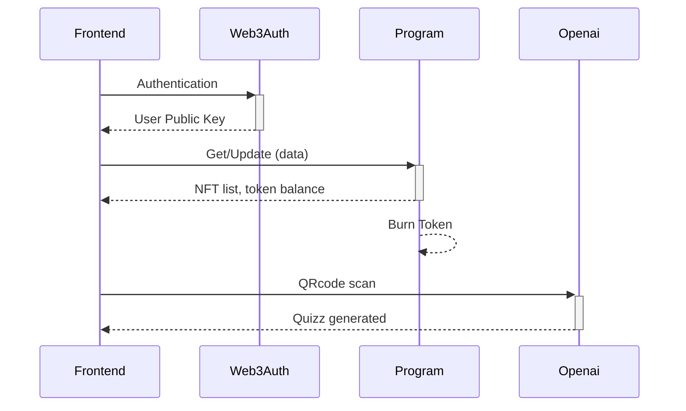

# Backend
API repository for our project, featuring a RESTful API designed to handle backend logic, data processing, and integrations.

Lets go !


# GemQuest

## Links
[`Vercel`](https://gemquest-pi.vercel.app/)

## Présentation du projet TBU

GemQuest est une application décentralisée (DApp) basée sur la blockchain Solana, conçue pour offrir une expérience interactive centrée sur la gestion de tokens et l'échange de NFTs. Les utilisateurs peuvent participer à des quizz interactifs, gagner des tokens, et les utiliser pour acheter des NFTs uniques dans une marketplace intégrée. L'application combine des éléments de jeu avec des transactions blockchain pour créer une plateforme immersive et engageante.

Voici un résumé du diagramme de séquence disponnible dans la partie 


## Technologies utilisées TBU

### Back-End (Blockchain) 🔗 : [`Link Here`](https://github.com/Crypt0zauruS/gemquest/tree/master/programs/gemquest)

Le back-end de GemQuest est construit sur la blockchain **Solana** et utilise le framework **Anchor** pour faciliter le développement de programmes. Anchor permet de gérer de manière robuste et sécurisée les interactions avec la blockchain, incluant la création de tokens, la gestion des NFTs, et les mécanismes de récompense et d'échange :

- **Solana Blockchain** : Fournit une infrastructure rapide et à faible coût pour les transactions décentralisées.
- **Anchor Framework** : Simplifie le développement de programme sur Solana en fournissant des outils et des abstractions de haut niveau.

### Front-End 🔗 : [`Link Here`](https://github.com/Crypt0zauruS/gemquest/frontend)

Le front-end de GemQuest est développé avec **React** et **Next.js**. Il utilise les librairie **Web3Auth** pet l'api **OpenAi** offrant une interface utilisateur réactive et optimisée pour une performance élevée :

- **React** : Utilisé pour construire une interface utilisateur dynamique et réactive, avec des composants modulaires et réutilisables.
- **Next.js** : Framework React qui permet le rendu côté serveur pour une meilleure performance et une optimisation SEO. Facilite également le routage et l'intégration API.
- **Web3Auth** : Assure une authentification sécurisée et sans friction.
- **OpenAI** : Génère des quizz interactifs, enrichissant l'expérience utilisateur.

## Installation et configuration TBU

Pour exécuter GemQuest localement, suivez ces étapes :

1. **Clonez le dépôt TBU** :
   ```bash
   git clone https://github.com/Crypt0zauruS/gemquest
   cd gemquest
   ```

2. **Installez les dépendances TBU** :
   - Back-end :
     ```bash
     cd anchor && npm install
     ```
   - Front-end :
     ```bash
     cd frontend && npm install
     ```

3. **Configurez les variables d'environnement TBU** :
   - Copiez le fichier `.env.local.example` en `.env` et ajustez les variables nécessaires.

4. **Démarrez les serveurs de développement TBU** :
   - Lancez le serveur Anchor :
     ```bash
     anchor test
     ```
   - Lancez le serveur Next.js :
     ```bash
     npm run dev
     ```


## Projets idées :  TBU##
- [] Game:
  - [X] Quizz


PM : (1 mois, 1,5 mois sur de l'accompagnement -> advisor)
Infra opti
sovereign chain (MultiversX) -> Droit à l'oubli
(dispo Aout)
